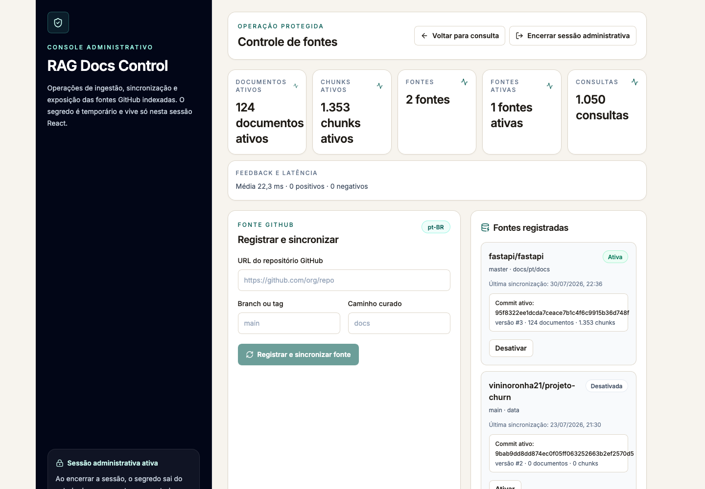
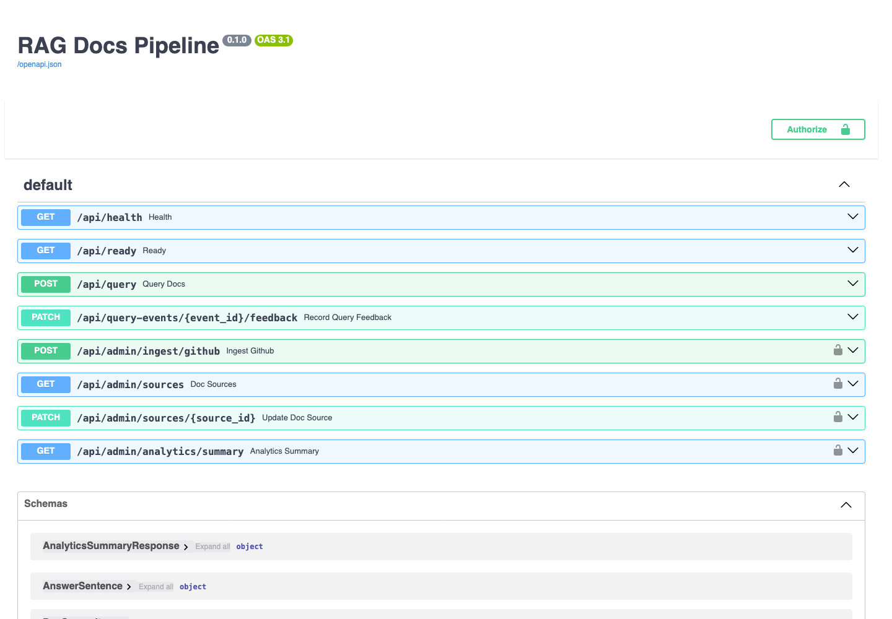

# 🤖 RAG Docs Pipeline

O RAG Docs Pipeline transforma documentação Markdown de repositórios GitHub em uma experiência de consulta rastreável. O usuário pergunta em linguagem natural, recebe uma resposta extraída do corpus e pode abrir a evidência original, presa ao mesmo commit usado na indexação.

## Visão do Produto

O projeto nasceu de um problema real: pesquisar manualmente em uma documentação extensa consome tempo, enquanto respostas geradas sem referência criam um novo problema de confiança.

## Como Funciona

O sistema conecta um repositório, cria uma base de conhecimento versionada e entrega respostas citation-first. Cada afirmação da resposta aponta para um trecho real, com caminho do arquivo, seção, commit e link permanente para o GitHub. Quando o corpus não oferece evidência suficiente, o sistema assume essa ausência em vez de inventar uma resposta.


## O Que Ele Entrega

- Consulta pública sobre documentação Markdown em linguagem natural.
- Ingestão e sincronização de repositórios GitHub por branch, caminho e commit.
- Respostas extrativas com citações por frase e evidências auditáveis.
- Busca híbrida com similaridade vetorial, PostgreSQL Full-Text Search e Reciprocal Rank Fusion.
- Estado explícito de `insufficient_evidence` para perguntas não sustentadas pelo corpus.
- Métricas operacionais sem persistir o texto das perguntas ou respostas.
- Execução completa em Docker Compose, sem exigir serviços pagos.



## 💭 Por Que um Pipeline de RAG (Retrieval-Augmented Generation)

O objetivo não é apenas colocar uma interface de chat sobre documentos. O diferencial está na cadeia de confiança: fonte versionada, recuperação, resposta extraída e prova navegável.

Uma nova versão só se torna ativa depois que a sincronização termina com sucesso. Na consulta, fontes desativadas e versões antigas ficam fora da recuperação. Esse desenho evita misturar documentação obsoleta com conteúdo atual e torna cada resposta reproduzível.


## Embeddings Locais vs LLM Externo
O modo padrão usa embeddings locais determinísticos e não depende de um LLM externo. Para cenários que pedem maior qualidade semântica, a integração com embeddings da OpenAI pode ser habilitada por configuração para trazer respostas mais aprofundadas e dinâmicas.

## 🚀 Como Utilizar

1. O administrador registra a URL do repositório, a branch e o caminho dos arquivos Markdown.
2. O backend resolve o commit, coleta o conteúdo e cria uma versão imutável da fonte.
3. Os documentos são divididos em chunks e indexados no PostgreSQL com pgvector e busca textual.
4. A pergunta passa por recuperação vetorial e Full-Text Search; os rankings são combinados com RRF.
5. O pipeline aplica limites de relevância e extrai apenas frases sustentadas pelos chunks recuperados.
6. O frontend apresenta a resposta, as citações e o trecho original fixado no commit correspondente.

A API também expõe contratos OpenAPI para saúde, prontidão, consultas, feedback e operações administrativas.



## Rodando Localmente

Pré-requisito: Docker Desktop com Docker Compose.

```bash
cp .env.example .env
docker compose up --build -d
```

Acesse:

- Aplicação: `http://localhost:3000`
- Painel de fontes: `http://localhost:3000/admin`
- API e Swagger UI: `http://localhost:8000/docs`
- Health check: `http://localhost:8000/api/health`
- Readiness de banco e pgvector: `http://localhost:8000/api/ready`

No ambiente local do Compose, use `local-admin-secret` para abrir o painel. Esse valor é apenas demonstrativo e deve ser substituído por uma password forte assegurada fora do ambiente local.

Fluxo recomendado:

1. Abra o painel administrativo e informe a password.
2. Registre um repositório GitHub, sua branch e o diretório que contém os arquivos Markdown.
3. Aguarde a sincronização confirmar o commit, a quantidade de documentos e os chunks ativos.
4. Volte à consulta pública, faça uma pergunta coberta pelo corpus e abra uma das citações.
5. Faça também uma pergunta fora do escopo para observar a recusa por evidência insuficiente.

Validação rápida dos serviços:

```bash
docker compose ps
curl --fail http://localhost:8000/api/health
curl --fail http://localhost:8000/api/ready
curl --fail http://localhost:3000/
```

Para configuração de variáveis e publicação, consulte [docs/environment.md](docs/environment.md) e [docs/deployment.md](docs/deployment.md).

## 🛠️ Stack

- Frontend: Next.js 16, React 18, TypeScript e Tailwind CSS.
- Backend: FastAPI, Pydantic, SQLAlchemy e Uvicorn.
- Banco de Dados: PostgreSQL 15, pgvector e Full-Text Search.
- Versionamento de schema: Alembic.
- Integrações: GitHub REST API e embeddings OpenAI opcionais.
- Testes: Pytest, Vitest, Testing Library e Ruff
- Infraestrutura: Docker Compose e GitHub Actions
- Deploy: Opções preparadas para hospedagem em Vercel, Render e Neon

## ✅ Testes e Qualidade

O projeto possui validação automatizada para backend, frontend, integração com banco e build de produção.

- Backend: lint com Ruff, testes com Pytest e testes de integração com PostgreSQL/pgvector.
- Frontend: typecheck com TypeScript, testes com Vitest/Testing Library e build do Next.js.
- CI: GitHub Actions executa validações em push para `main` e em pull requests.
- Smoke tests: script para validar frontend, backend, readiness da API e fluxo principal após deploy.

```bash
# Backend
ruff check backend
pytest backend/tests --ignore=backend/tests/integration

# Frontend
cd frontend
npm run typecheck
npm run test:run
npm run build
```

## 📁 Estrutura do Projeto

```text
rag-docs-pipeline/
├── .github/workflows/      # Automação de CI com GitHub Actions
├── assets/                 # Imagens e vídeo de demonstração do projeto
├── backend/                # API FastAPI, pipeline RAG, banco e testes
│   ├── alembic/            # Migrações de schema do banco
│   ├── app/                # Código principal do backend
│   │   ├── api/            # Rotas públicas e administrativas
│   │   ├── core/           # Configuração, segurança, rate limit e observabilidade
│   │   ├── db/             # Sessão, modelos e acesso ao banco
│   │   └── services/       # GitHub, ingestão, chunking, embeddings, busca e resposta
│   ├── scripts/            # Scripts auxiliares de verificação e avaliação
│   └── tests/              # Testes unitários e de integração
├── docs/                   # Documentação de ambiente e deploy
├── evaluation/             # Conjunto de avaliação de recuperação em português
├── frontend/               # Aplicação Next.js
│   ├── app/                # Rotas e páginas do App Router
│   ├── components/         # Componentes de chat, evidência e administração
│   ├── lib/                # Cliente da API e utilitários
│   └── test/               # Setup e mocks de testes frontend
├── scripts/                # Smoke tests executáveis localmente ou pós-deploy
├── docker-compose.yml      # Orquestração local de frontend, backend e PostgreSQL
├── render.yaml             # Contrato de deploy do backend no Render
└── README.md               # Visão geral do projeto
```

## 💻 Next Steps

Para evoluir o projeto, os próximos passos seriam autenticação por usuário, cotas distribuídas, filas de ingestão e políticas de custo. A versão atual prioriza uma entrega clara, funcional e verificável do problema que se propõe a resolver.

Os detalhes técnicos e a documentação fica em [SUMMARY.md](SUMMARY.md).

## 📝 Licença

Este projeto está sob a licença MIT. Veja o arquivo [LICENSE](LICENSE) para mais detalhes.

---

## 👨‍💻 Autor

Desenvolvido por **Vinícius Forte**

- 🐙 GitHub: [vininoronha21](https://github.com/vininoronha21)
- 💼 LinkedIn: [Vinícius Noronha](https://linkedin.com/in/viniciusnoronha)
- 📧 Email: contatovininoronha@gmail.com
