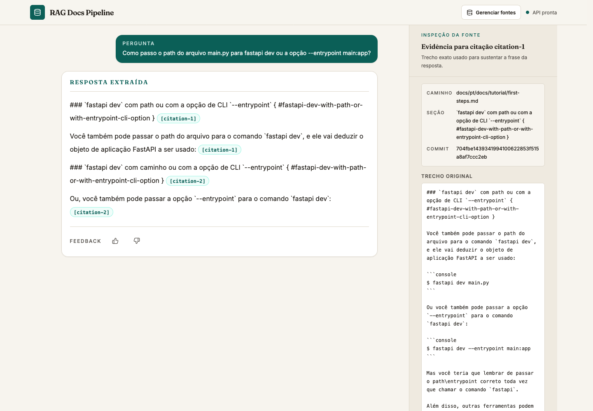
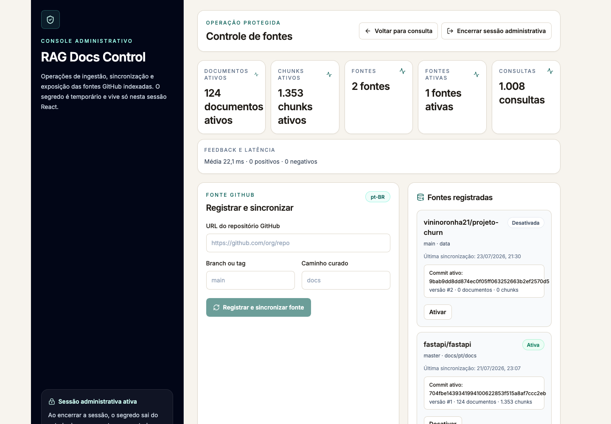

# RAG Docs Pipeline

Documentação não costuma falhar por falta de conteúdo. Ela falha quando a resposta certa está espalhada entre arquivos, seções e versões diferentes — e ninguém consegue afirmar com segurança de onde aquela informação veio.

O RAG Docs Pipeline transforma documentação Markdown de repositórios GitHub em uma experiência de consulta rastreável. O usuário pergunta em linguagem natural, recebe uma resposta extraída do corpus e pode abrir a evidência original, presa ao mesmo commit usado na indexação.

## Visão do Produto

A ideia nasceu de uma dor prática: pesquisar manualmente em uma documentação extensa consome tempo, enquanto respostas geradas sem referência criam um novo problema de confiança.

O projeto conecta um repositório, cria uma base de conhecimento versionada e entrega respostas *citation-first*. Cada frase respondida aponta para um trecho real, com caminho do arquivo, seção, commit e link permanente para o GitHub. Quando o corpus não sustenta a pergunta, o sistema assume a ausência de evidência em vez de inventar uma resposta.



## O Que Ele Entrega

- Consulta pública sobre documentação Markdown em linguagem natural.
- Ingestão e sincronização de repositórios GitHub por branch, caminho e commit imutável.
- Respostas extrativas com citações por frase e evidências auditáveis.
- Busca híbrida com similaridade vetorial, PostgreSQL Full-Text Search e Reciprocal Rank Fusion.
- Estado explícito de `insufficient_evidence` para perguntas não sustentadas pelo corpus.
- Painel administrativo protegido para registrar, ativar, desativar e sincronizar fontes.
- Métricas operacionais sem persistir o texto das perguntas ou respostas.
- Execução completa em Docker Compose, sem exigir serviços pagos no modo local.



## Por Que É Diferente

O objetivo não é apenas colocar uma interface de chat sobre documentos. O diferencial está na cadeia de confiança: fonte versionada, recuperação híbrida, resposta extraída e prova navegável.

Uma nova versão só se torna ativa depois que a sincronização termina com sucesso. Na consulta, fontes desativadas e versões antigas ficam fora da recuperação. Esse desenho evita misturar documentação obsoleta com conteúdo atual e torna cada resposta reproduzível.

O modo padrão usa embeddings locais determinísticos e não depende de um LLM externo. Para cenários que pedem maior qualidade semântica, a integração com embeddings da OpenAI pode ser habilitada por configuração.

## Como Funciona

1. O administrador registra a URL do repositório, a branch e o caminho dos arquivos Markdown.
2. O backend resolve o commit, coleta o conteúdo e cria uma versão imutável da fonte.
3. Os documentos são divididos em chunks e indexados no PostgreSQL com pgvector e busca textual.
4. A pergunta passa por recuperação vetorial e Full-Text Search; os rankings são combinados com RRF.
5. O pipeline aplica limites de relevância e extrai apenas frases sustentadas pelos chunks recuperados.
6. O frontend apresenta a resposta, as citações e o trecho original fixado no commit correspondente.

A API também expõe contratos OpenAPI para saúde, prontidão, consultas, feedback e operações administrativas.


## Rodando Localmente

Pré-requisito: Docker Desktop com Docker Compose.

```bash
cp .env.example .env
docker compose up --build -d
```

Acesse:

- Aplicação: `http://localhost:3000`
- Painel de fontes: `http://localhost:3000/admin`
- API e Swagger UI: `http://localhost:8000/docs`
- Health check: `http://localhost:8000/api/health`
- Readiness de banco e pgvector: `http://localhost:8000/api/ready`

No ambiente local do Compose, use `local-admin-secret` para abrir o painel. Esse valor é apenas demonstrativo e deve ser substituído por um segredo forte fora do ambiente local.

Fluxo recomendado:

1. Abra o painel administrativo e informe o segredo local.
2. Registre um repositório GitHub, sua branch e o diretório que contém os arquivos Markdown.
3. Aguarde a sincronização confirmar o commit, a quantidade de documentos e os chunks ativos.
4. Volte à consulta pública, faça uma pergunta coberta pelo corpus e abra uma das citações.
5. Faça também uma pergunta fora do escopo para observar a recusa por evidência insuficiente.

Validação rápida dos serviços:

```bash
docker compose ps
curl --fail http://localhost:8000/api/health
curl --fail http://localhost:8000/api/ready
curl --fail http://localhost:3000/
```

Para configuração de variáveis e publicação, consulte [docs/environment.md](docs/environment.md) e [docs/deployment.md](docs/deployment.md).

## Stack

- Frontend: Next.js 16, React 18, TypeScript e Tailwind CSS.
- Backend: FastAPI, Pydantic, SQLAlchemy assíncrono e Uvicorn.
- Banco: PostgreSQL 15, pgvector e Full-Text Search.
- Versionamento de schema: Alembic.
- Integrações: GitHub REST API e embeddings OpenAI opcionais.
- Qualidade: Pytest, Vitest, Testing Library, Ruff e TypeScript.
- Infraestrutura: Docker Compose, com contratos preparados para Vercel, Render e Neon.

## Status

O projeto está pronto como demonstração local e portfólio técnico. A auditoria final validou 317 testes de backend, 36 testes de frontend, build de produção, sincronização real com o GitHub, benchmark de recuperação, auditorias de dependências sem vulnerabilidades conhecidas e o fluxo real no Firefox sem erros de console.

Para evoluir para um SaaS público multiusuário, os próximos passos seriam autenticação por usuário, cotas distribuídas, filas de ingestão, sincronização agendada, observabilidade hospedada e políticas de custo. A versão atual prioriza uma entrega clara, funcional e verificável do problema que se propõe a resolver.

Os detalhes técnicos e as evidências de validação ficam em [SUMMARY.md](SUMMARY.md).
